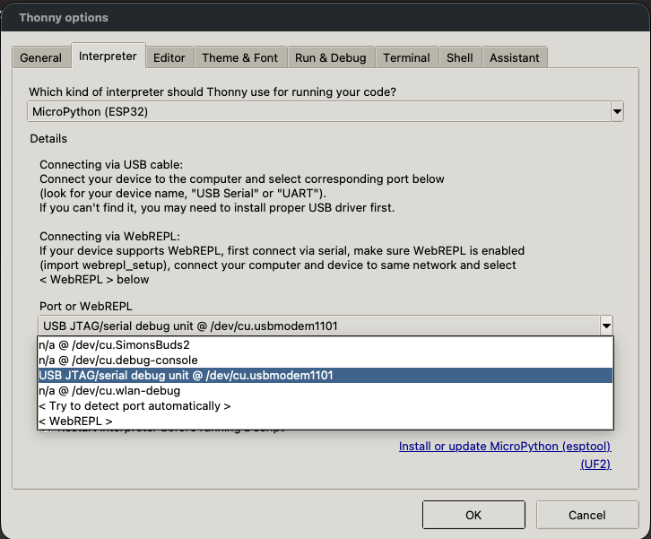

# ESP32 C3 Mini Development Board Learning

A huge shout out to this resource for helping piece things together [Kevin's Blog | ESP32-C3 0.42 OLED](https://emalliab.wordpress.com/2025/02/12/esp32-c3-0-42-oled/)


## Initial Setup

1. Download and install [Thonny - Python IDE for beginners](https://thonny.org/) 


Tools
 * [esptool](https://docs.espressif.com/projects/esptool/en/latest/esp32c3/)

Get [esptool](https://pypi.org/project/esptool/) - "A Python-based, open-source, platform-independent serial utility for flashing, provisioning, and interacting with Espressif SoCs." [Espressive | Esptool Documentation | Quickstart](https://docs.espressif.com/projects/esptool/en/latest/esp32c3/#quick-start)

```bash
pip install esptool
```

Download the MicroPython Firmware from [MicroPython | C3 mini | Firmware](https://micropython.org/download/LOLIN_C3_MINI/)

At time of writing the latest is `v1.28.0 (2026-04-06).bin` which resulted in a download called `OLIN_C3_MINI-20260406-v1.28.0.bin`

Plugin the ESP32 to your laptop.

Figure out the serial port that the device. As described in [MicroPython | C3 mini | Installation Instructions](https://micropython.org/download/LOLIN_C3_MINI/)

> * On Linux, the port name is usually similar to `/dev/ttyACM0`.
> * On Mac, the port name is usually similar to `/dev/cu.usbmodem01`.
> * On Windows, the port name is usually similar `to COM4`

Erase the board. Since I am on a mac
```bash
$ esptool --port /dev/cu.usbmodem1101 erase_flash
```

Flash MicroPython onto the board
```bash
$ esptool --port /dev/cu.usbmodem1101 write-flash 0 ~/Downloads/OLIN_C3_MINI-20260406-v1.28.0.bin
```
```
Warning: Deprecated: Command 'write_flash' is deprecated. Use 'write-flash' instead.
esptool v5.2.0
Connected to ESP32-C3 on /dev/cu.usbmodem1101:
Chip type:          ESP32-C3 (QFN32) (revision v0.4)
Features:           Wi-Fi, BT 5 (LE), Single Core, 160MHz, Embedded Flash 4MB (XMC)
Crystal frequency:  40MHz
USB mode:           USB-Serial/JTAG
MAC:                14:63:93:76:39:7c

Stub flasher running.

Configuring flash size...
Flash will be erased from 0x00000000 to 0x001a5fff...
Wrote 1724672 bytes (1035222 compressed) at 0x00000000 in 3.9 seconds (3513.7 kbit/s).
Hash of data verified.

Hard resetting via RTS pin...
```

# Connect to the board

## Thonny (easiest)
 [thonny](https://thonny.org/)



## mpremote
 * [mpremote](https://docs.micropython.org/en/latest/reference/mpremote.html)

List devices
```bash
$ mpremote devs
```
```
/dev/cu.usbmodem1101 14:63:93:76:39:7C 303a:1001 Espressif USB JTAG/serial debug unit
/dev/cu.Bluetooth-Incoming-Port None 0000:0000 None None
/dev/cu.debug-console None 0000:0000 None None
/dev/cu.wlan-debug None 0000:0000 None None
```

```bash
$ mpremote connect /dev/cu.usbmodem1101
Connected to MicroPython at /dev/cu.usbmodem1101
Use Ctrl-] or Ctrl-x to exit this shell

>>>
```

Run a help command
```python
 >>> help()
Welcome to MicroPython on the ESP32!

For online docs please visit http://docs.micropython.org/
[...]
```

## Installing Dependencies

```python
>>> import mip
>>> mip.install("urequests")
```

 * AHT20+BMP280 Temperature Humidity Air Pressure Module

|ESP32|Wire|AHT20+BMP280|
|---|---|---|
|`3V3`|RED|`VCC`|
|`GND`|BLACK|`GND`|
|`IO5`|BLUE|`SDA`|
|`IO6`|YELLOW|`SCL`|

## Optimising the VS Code Devloop

The fastest loop I have found is:

1. Edit code in VS Code.
2. Save the changed files.
3. Push `src/main.py` and `src/lib/*` to the board with `mpremote`.
4. Soft-reset the board.
5. Watch the serial output in the same terminal.

### Recommended VS Code setup

Install these extensions:

* [Python](https://marketplace.visualstudio.com/items?itemName=ms-python.python)
* [Pylance](https://marketplace.visualstudio.com/items?itemName=ms-python.vscode-pylance)
* [MicroPico](https://marketplace.visualstudio.com/items?itemName=paulober.pico-w-go) if you want MicroPython helpers inside VS Code

Use the local virtual environment for desktop tooling:

```bash
uv sync
```

Then select the workspace interpreter in VS Code:

```text
.venv/bin/python
```

This keeps `esptool` and `mpremote` pinned to the versions in `pyproject.toml` instead of whichever versions happen to be installed globally.

### Find the board port

The serial port can change when the board is unplugged or reset, so keep this command handy:

```bash
uv run mpremote devs
```

For my board it currently looks like:

```text
/dev/cu.usbmodem1101
```

When the port changes, update the commands below.

### Upload and run from the terminal

From the project root:

```bash
uv run mpremote connect /dev/cu.usbmodem1101 fs cp src/lib/ssd1306.py :ssd1306.py
uv run mpremote connect /dev/cu.usbmodem1101 fs cp src/lib/sh1106.py :sh1106.py
uv run mpremote connect /dev/cu.usbmodem1101 fs cp src/main.py :main.py
uv run mpremote connect /dev/cu.usbmodem1101 reset
```

Then open the REPL / serial monitor:

```bash
uv run mpremote connect /dev/cu.usbmodem1101
```

Useful REPL shortcuts:

* `Ctrl-D` soft resets the board.
* `Ctrl-C` interrupts a running script.
* `Ctrl-]` or `Ctrl-X` exits `mpremote`.

### Add VS Code tasks

Create `.vscode/tasks.json` if it does not exist:

```json
{
  "version": "2.0.0",
  "tasks": [
    {
      "label": "ESP32: list devices",
      "type": "shell",
      "command": "uv run mpremote devs",
      "problemMatcher": []
    },
    {
      "label": "ESP32: upload files",
      "type": "shell",
      "command": "uv run mpremote connect /dev/cu.usbmodem1101 fs cp src/lib/ssd1306.py :ssd1306.py && uv run mpremote connect /dev/cu.usbmodem1101 fs cp src/lib/sh1106.py :sh1106.py && uv run mpremote connect /dev/cu.usbmodem1101 fs cp src/main.py :main.py",
      "problemMatcher": []
    },
    {
      "label": "ESP32: reset",
      "type": "shell",
      "command": "uv run mpremote connect /dev/cu.usbmodem1101 reset",
      "problemMatcher": []
    },
    {
      "label": "ESP32: upload and reset",
      "dependsOrder": "sequence",
      "dependsOn": [
        "ESP32: upload files",
        "ESP32: reset"
      ],
      "problemMatcher": []
    },
    {
      "label": "ESP32: serial monitor",
      "type": "shell",
      "command": "uv run mpremote connect /dev/cu.usbmodem1101",
      "problemMatcher": [],
      "isBackground": true
    }
  ]
}
```

Now run tasks from the command palette:

```text
Tasks: Run Task
```

The everyday loop becomes:

1. Save your file.
2. Run `ESP32: upload and reset`.
3. Run or focus `ESP32: serial monitor`.

### Optional VS Code settings

Create `.vscode/settings.json`:

```json
{
  "python.defaultInterpreterPath": "${workspaceFolder}/.venv/bin/python",
  "files.trimTrailingWhitespace": true,
  "files.insertFinalNewline": true,
  "python.analysis.extraPaths": [
    "${workspaceFolder}/src/lib"
  ],
  "python.analysis.diagnosticSeverityOverrides": {
    "reportMissingModuleSource": "none",
    "reportMissingImports": "none"
  }
}
```

The diagnostic overrides are helpful because desktop Python cannot import MicroPython-only modules like `machine`, `network`, and `_thread`.

### Make the loop even tighter

Once the manual task loop feels solid, consider adding a small sync script that:

* detects the current `/dev/cu.usbmodem*` port automatically,
* uploads only changed files,
* resets the board after upload,
* optionally opens the serial monitor.

Until then, VS Code tasks give a nice middle ground: repeatable commands, no extra tooling, and no need to leave the editor.
